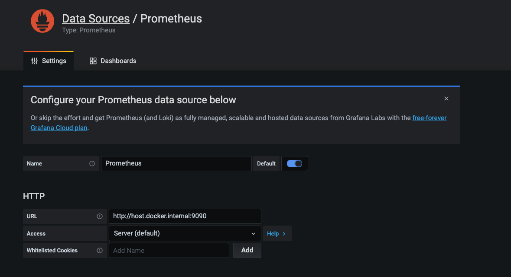
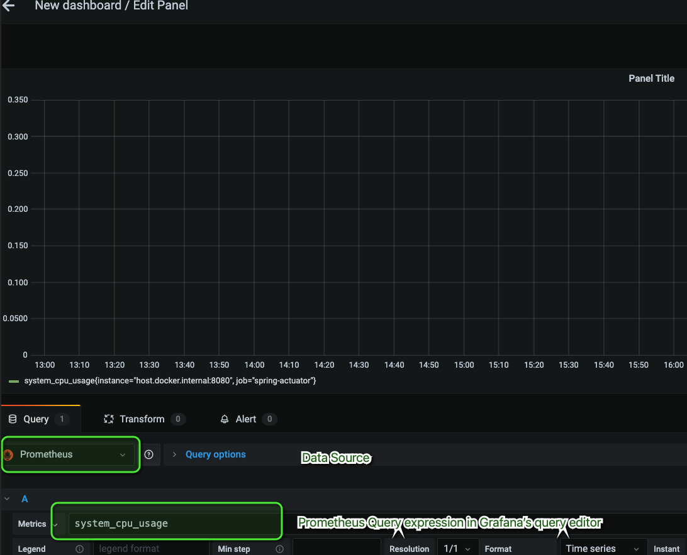

# Process:

1. **Spring Boot Actuator** -  built-in mechanism for collecting the most important metrics. In fact, we just need to set some configuration properties to expose predefined set of metrics provided by Spring Boot Actuator. To use it we need to include Actuator starter as dependency:
```
org.springframework.boot:spring-boot-starter-actuator
```

2. To enable [Actuator endpoints](https://docs.spring.io/spring-boot/docs/current/reference/html/production-ready-features.html#production-ready-endpoints)  we have to enable and expose them in application.yml profile
   
* By default, all endpoints except for `shutdown` are enabled. To configure the enablement of an endpoint, use its `management.endpoint.<id>.enabled` property.
* An endpoint is considered to be available when it is both enabled and exposed.

Solution - use `application.yml` and `application-local.yml` (with more relaxed policy)

3. You can check all endpoints evailable via `/actuator` endpoint


3. In order to integrate with external application monitoring system (Prometheus,Graphite,DataDog,Influx,Wavefront,New Relic) - we need to use Micrometer. 
   
* Use with Prometheus - add dependency 
```
 runtimeOnly("io.micrometer:micrometer-registry-prometheus")
```

4. Add configuration to Prometheus Server (check docker-compose file) to `prometheus.yml` - from where scrape the data
```
 - job_name: 'spring-actuator'
    metrics_path: '/actuator/prometheus'
    scrape_interval: 5s
    static_configs:
    - targets: ['HOST_IP:8080']
```


5. Start Prometheus container
```
$ docker run -d --name=prometheus -p 9090:9090 -v <PATH_TO_prometheus.yml_FILE>:/etc/prometheus/prometheus.yml prom/prometheus --config.file=/etc/prometheus/prometheus.yml
```

* check stats from UI - http://localhost:9090

6. Start Grafana container
```
docker run -d --name=grafana -p 3000:3000 grafana/grafana 
```
You can now navigate to http://localhost:3000 and log in to Grafana with the default username admin and password admin

6.1. Add Data Source to Grafana (Add HTTP URL as you defined in prometheus.yml) - can be `prometheus:9090` (if ts the name of the container) or `host.docker.internal` (if ports are exposed like 9090:9090)

6.2. Create a new Dashboard with a Graph 

After configuring the data source, Its time to create a dashboard to visualize Prometheus metrics. For that click on New Dashboard in home page and click on Choose Visualization. 
Here you can select visualization (Graph, Singlestat, Guage, Table, Text, etc.). I used Graph mode to visualize metrics data.

* After that, you have to provide Prometheus Query expression in Grafana’s query editor. For demo purpose, I have given go_memstats_gc_cpu_fraction visualize metrics in Grafana and finally, you can see the graph as follows.

Resources:


* [Prometheus - GRAFANA SUPPORT FOR PROMETHEUS](https://prometheus.io/docs/visualization/grafana/)
* [Configure Prometheus and Grafana in Dockers](https://medium.com/aeturnuminc/configure-prometheus-and-grafana-in-dockers-ff2a2b51aa1d)
* [Grafana tutorial](https://grafana.com/tutorials/grafana-fundamentals)
